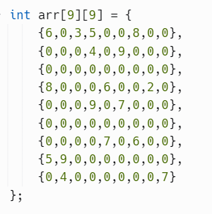
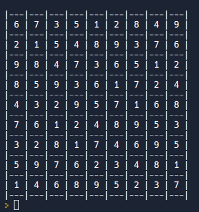

# Sudolu-Solver
This is my attempt to create Sudoku Solver using Backtracking

- Just clone the repository or just copy the code and try it to solve any sudoku

### Here are some images

<table>
    <th>This is input</th>
    <th>This is output</th>
    <tr>
        <td>
            
        </td>
        <td>
            
        </td>
    </tr>
</table>
